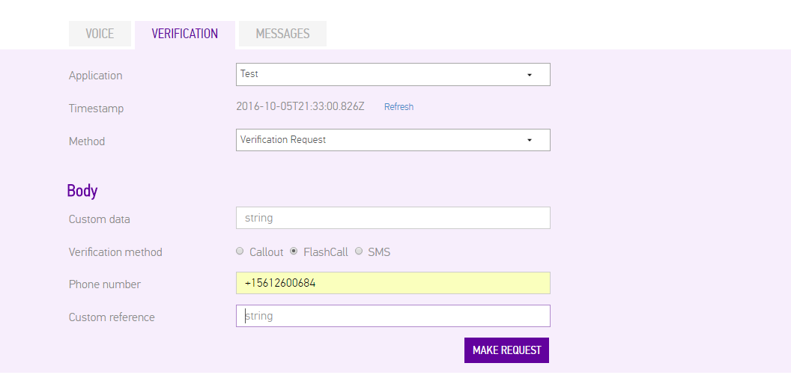
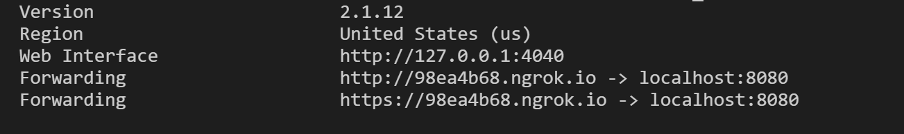
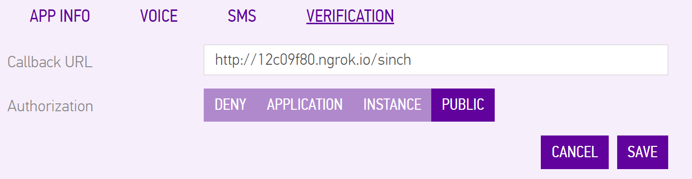
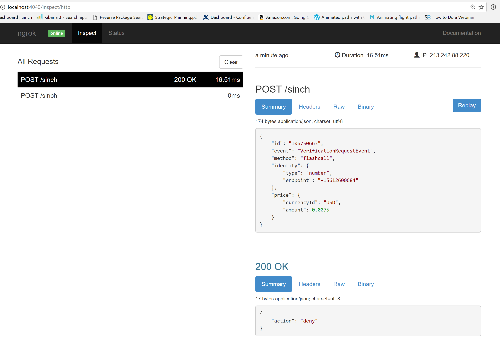
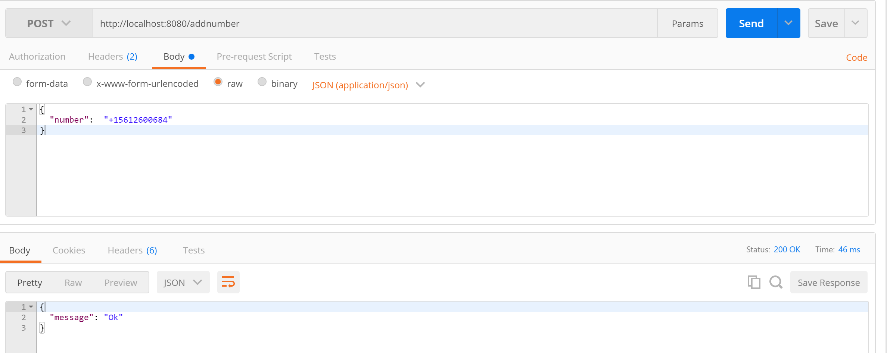
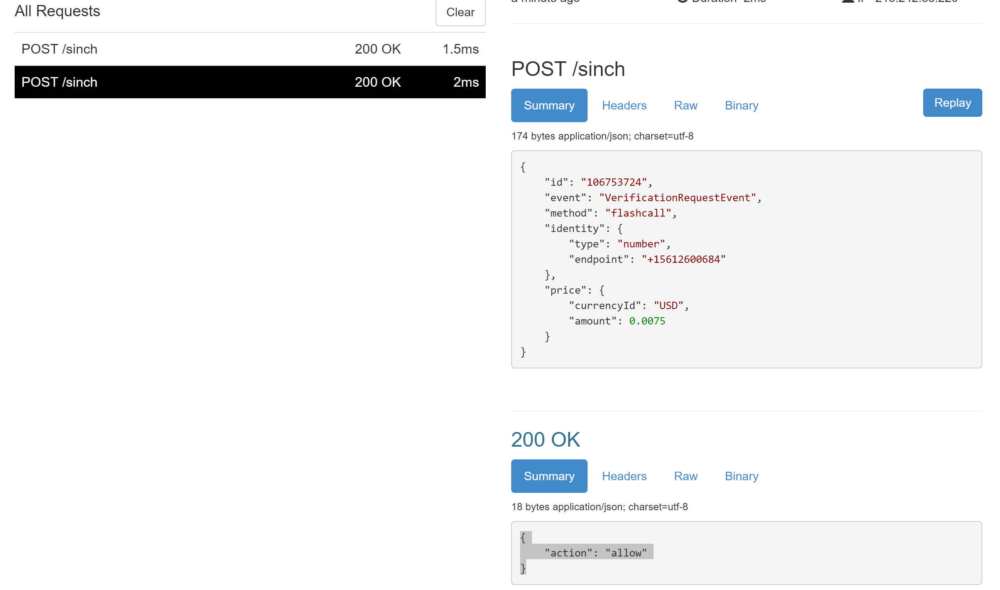

# Securing your Verifications when using Sinch

In this blog post we will talk about the different ways of making sure no one is attacking you or using your account do verifications.

## Two different ways of securing your app
Sinch has 2 ways to secure your app, the first one that this blog post will dig in to detail about is the [Callback/webhook](https://www.sinch.com/docs/verification/rest/#verificationcallbackapi "CallbackAPI") way of securing it, the other way that is a post for another day is Application Signed requests.

### Webhooks
This is the recommended way of securing your verification. Using Sinch Verification we send two events to your back end (if configured), one when someone wants to create a verification, one when the client tried to authenticate. 

We chose this approach for a couple of reasons, the first was to enable developers to easy try it out with no backend, the second we did want either have the key in app and for a process that most likely will only occur once in an install life time the token generation with oath seemed like a over complicated way of doing it. So we landed on web hooks. Its a simple enought concept and in our view makes perfect sense to have an evendriven model to handle this.


You can verify that the request is from us by signing the request you receive and compare the hash https://www.sinch.com/using-rest/#Authorization or if you prefer ship a custom variable like your own Token for you own api requests and validate that in the custom variables

## Using node to respond to your callbacks
Lets set up a backend to allow or deny a verification attempt. Today we will use node, and create the requests using our [api explorer](https://www.sinch.com/dashboard/#/api) that you find in the dashboard. 


We are going to set up the node app with [express](http://expressjs.com/) which is an awesome framwork for MVC patterns. 

- Create the app
```bash
npm init
```
Just accept all defaults. 

```bash
npm install --save express body-parser
```

With basic wiring setup lets start writing some code, as I mentioned before when a verification reqeust is made you get that event posted to an endpoint, That request will be an POST request and contains something like this. 
```
{
    "id":"1234567890",
    "event": "VerificationRequestEvent",
    "method": "flashCall",
    "identity": { "type":"number", "endpoint":"+46700000000" },
    "price": { "amount": 0.005, "currencyId":"USD" } ,
	"custom":"your custom data, you can make json if you want"   
}
```

There is a few parameters here that I want to point out, we need the event to know what kind of event is being sent to us, and either the identity or use custom data to identify if we want to allow or deny the request. 

Creaet a file named index.js and start hook express

index.json
```
var express    = require('express');        // call express
var bodyParser = require('body-parser');

function logResponseBody(req, res, next) {
// intercept all requests and set response type to json, and log it for debug 
  res.setHeader('Content-Type', 'application/json');
  console.log(JSON.stringify(req.body, null, 2));
  next();
}

var app = express();
app.use(bodyParser.json());
app.use(bodyParser.urlencoded({ extended: false }));
app.use(logResponseBody);
var port = process.env.PORT || 8080;        // set our port
var router = express.Router();  

router.post('/sinch', function(req, res) {
    res.json({ message: 'Here we need to respond correct SVAML' });   
});
app.use('/api', router);
app.listen(port);
module.exports = app;
```

Now if you start it you can post with post man to the localhost:8080/sinch and you will set message response. Not so exciting so lets get it real. What we want to do is: 
1. Create a endpoint that is secured with your own custom login in token for users (i.e oauth2 or your custom auth scheme) where you add numbers you want to verify. 
2. Store that in a database (in this tutorial i will just use in memory as an example) 
3. A sinch webhook endpoint that 
	1. Look up the number on initate request before allowing if a hit, allow otherwise deny
	2. When a verification is successful,remove it fromteh list of numbers. 


### Endpoint to add numbers
Add a varialbe to hold numbers that is global

```javascript
var numbers = [];
router.post('/addnumber', function (req, res) {
  //your custom api security like an oath bearer token
  //in this tutorials we are going to save the numbers in memory, 
  //in production you prob want to either persist it or use a rediscache or similiar
  numbers.push(req.body['number'])
  res.json({ message: 'Ok' });
});
```

The code above doesnt do anything fancy, just pushing a new number in to the array. We will use this in the webhook endpoing next 

### Responding to webhook events
Sinch post every event to the same endpoint, so the first task is to detemine if the event is a Request or Result event, so thats what I first need to do. The requestEvent is triggered when someone starts a verification, the result event is triggered everytime someone tries to verify a code. 

```javascript
router.post('/sinch', function (req, res) {
  //look the type of event VerificationRequestEvent or VerificationResultEvent
  if (req.body['event'] == 'VerificationRequestEvent') {
  }
  else if (req.body['event'] == 'VerificationResultEvent') {
    }
});
```
Next I will add implementation to handle the RequestEvent, by checking if the number is in allowed number array. If you want this is also where you can set the code and make some other changes to the Veriifcation requests. see the documentation for more [details](http://sinch.com/docs/verificaiton/rest)
 
```javascript
router.post('/sinch', function (req, res) {
  //look the type of event VerificationRequestEvent or VerificationResultEvent
  if (req.body['event'] == 'VerificationRequestEvent') {
    if (lookUpNumber(req.body['identity']['endpoint'])) {
      res.json({ action: 'allow' });

    } else {
      res.json({ 'action': 'deny' });
    }
  }
  else if (req.body['event'] == 'VerificationResultEvent') {
  }
});
```
So funciton lookUpNumber returns true, allow it other wise deny. This is the time where I really miss c# with its lambda, would be so nice to just be able to query the array for the key instead of a custom function anyway today is node, lets implement the custom function. 

```javascript
function lookUpNumber(number) {
  for (var p in numbers) {
    if (numbers[p] == number) {
      return true;
    }
  }
  return false;
}
```

That finishes off the implementation for the Request event, next I want to handle the result event. I want to look at the result if its a success, remove it from the list (if fail i should notify the client, but thats out of scope for this tutorial)

In the if statement for "VerificationResultEvent" I added this code 

```javascript
if (req.body['status'] == 'SUCCESSFUL') {
  //remove the number if it was SUCCESSFUL
  removeNumber(req.body['identity']['endpoint']);
  res.status(200); //Sinch realy dosent care if you reply but its a nice gesture to reply to us :D
  res.json();
}
else {
  //take some action in the app to let the user know it failed. 
}

```

And the function to search and remove an element in an array 
```javascript
function removeNumber(number) {
  for (var p in numbers) {
    if (numbers[p] == number) {
      numbers.splice(p, 1);
    }
  }
}
```


Now I just need to test it, to that I will use  [ngrok](https://ngrok.com/ "ngrok") if you havent set it up, check out my previous post about ngrok [insert link]
start up ngrok

```bash
>ngrok http 8080
```


So I will head over to my app in the dashboard and change the url to  the above url. 

  
 
I use the dev tools in the portal to hit my number again, and of course this happens



I forgot to add my number to allowed numbers to verify, so using postman (another awesome tool) I add my number to the list


Awsome, lets hit it again and now I get the expected allow


# Whats next
In order to use our verificaiton SDK, next steps for a real app would be to add logging, support for more 
types of verificaitons and of course a real persistence and real security on my add numbers end points. 

Would be interested in a complete backend for this or are you more interested in snippets like this or shorter?
Let me know in the comments or tweet me at @cjsinch


